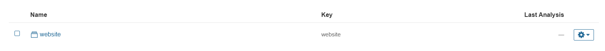
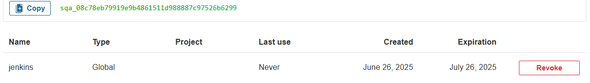
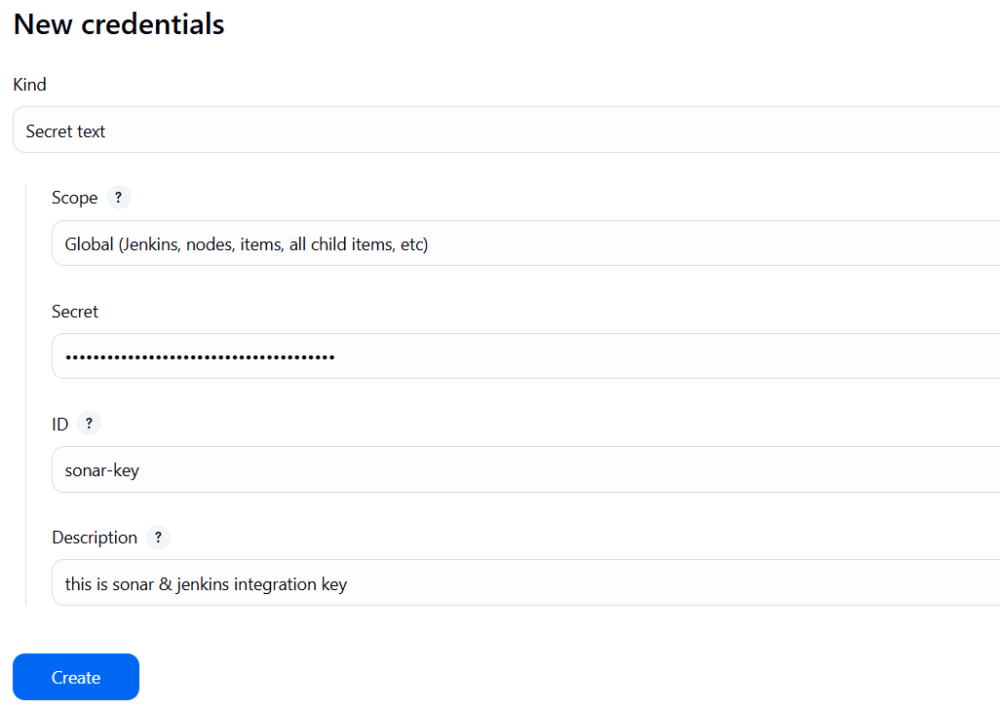
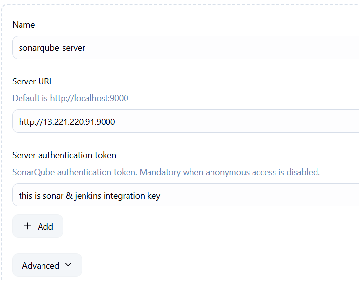
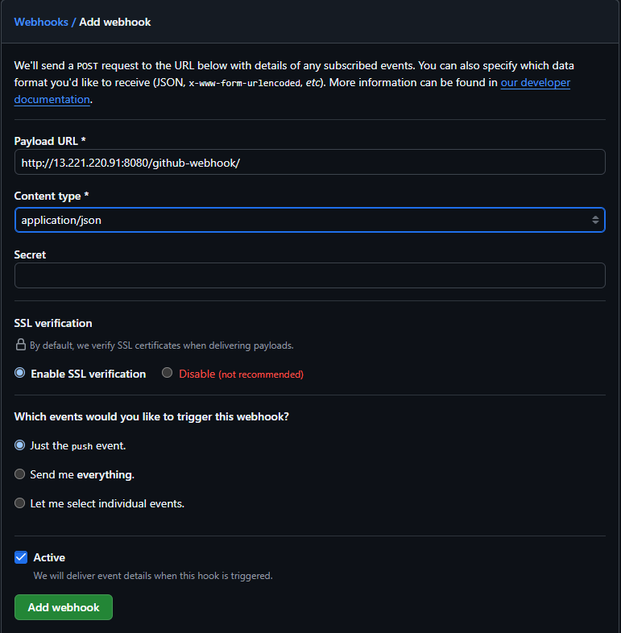
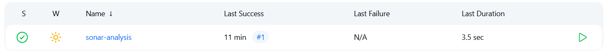
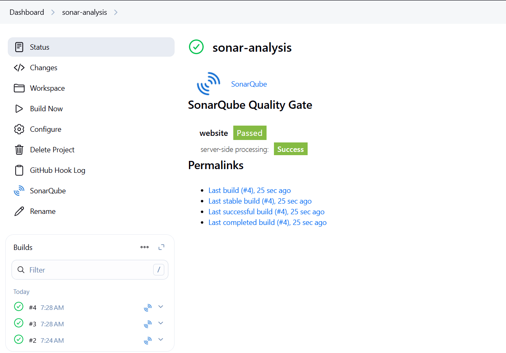
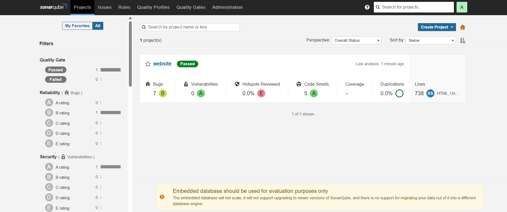
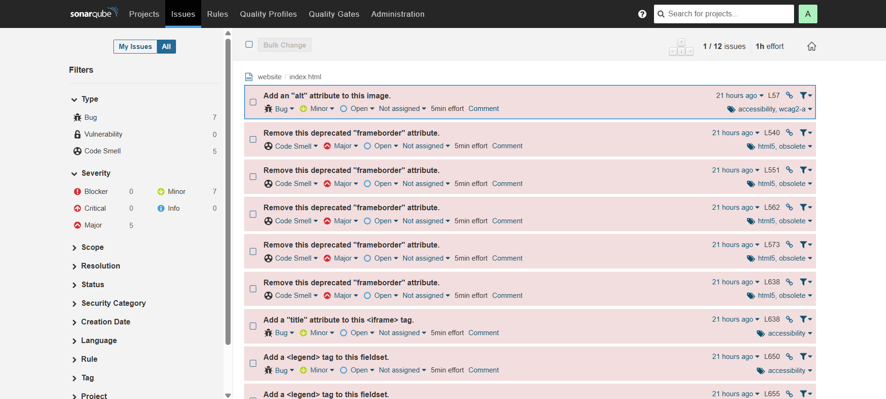

# TASK-4-INTEGRATE-SECURITY-SCANNING-TOOL

Company: CODETECH IT SOLUTION

Name: YASH SURYARAO

Intern ID: [Your ID]

Domain: DEVOPS

Duration: 8 WEEKS

Mentor: NEELA SANTOSH

---

### What is SonarQube?
SonarQube is an open-source platform used for continuous inspection of code quality. It analyzes code to detect bugs, code smells, security vulnerabilities, and ensures adherence to coding standards.

### Why SonarQube?
- Supports 27+ programming languages
- Integrates seamlessly with CI/CD pipelines
- Provides actionable feedback to developers
- Helps in maintaining code quality and security
- Trusted by over 225,000 deployments worldwide

---

### 1. Importance of Static Code Analysis
- Early Bug Detection: Identify and resolve issues early in the software development lifecycle.
- Maintainability: Improve the long-term readability and supportability of code.
- Security: Spot potential vulnerabilities before they reach production.
- Compliance: Enforce coding standards and best practices.

### 2. Code Quality Checks with SonarQube
- Checks for code duplication, complexity, potential bugs
- Verifies test coverage and coding standards compliance
- Provides visual dashboards with remediation guidance

### 3. 


### SonarQube Best Practices
- Set up quality gates to define thresholds
- Treat issues seriously and prioritize critical ones
- Customize rules to match project needs
- Analyze pull requests before merging
- Use comments to explain suppressed issues

---

## SonarQube Setup on AWS EC2 using Docker, Jenkins

### Step 1: Install Docker on Ubuntu EC2
```bash
sudo apt update -y
sudo apt install docker.io -y
sudo usermod -aG docker ubuntu
sudo usermod -aG docker $USER
newgrp docker
sudo chmod 777 /var/run/docker.sock
sudo systemctl restart docker
```

### Step 2: Create SonarQube Container
- Make sure port 9000 is open in the EC2 security group
```bash
docker run -d --name sonar -p 9000:9000 sonarqube:lts-community
```
- Access the SonarQube dashboard: http://<EC2-IP>:9000
- Default login: admin / admin

### Step 3: Jenkins Installation on Ubuntu EC2
```bash
sudo apt update -y
sudo apt install fontconfig openjdk-21-jre -y
java -version

sudo wget -O /usr/share/keyrings/jenkins-keyring.asc \
  https://pkg.jenkins.io/debian-stable/jenkins.io-2023.key

echo deb [signed-by=/usr/share/keyrings/jenkins-keyring.asc] \
  https://pkg.jenkins.io/debian-stable binary/ | sudo tee \
  /etc/apt/sources.list.d/jenkins.list > /dev/null

sudo apt update -y
sudo apt install jenkins -y

sudo systemctl enable jenkins
sudo systemctl start jenkins
sudo systemctl status jenkins
```

---

### Jenkins-SonarQube Integration

### Step 1: Install Plugins
- Go to: Jenkins Dashboard > Manage Jenkins > Manage Plugins
- Install:
  - `SonarQube Scanner` for Jenkins
  - `Eclipse Temurin Installer` (for JDK)
  - 
### Step 2: Configure SonarQube Server in Jenkins
- Go to: Jenkins Dashboard > Manage Jenkins > Configure System
- Scroll to SonarQube servers
- Add name, URL (`http://<EC2-IP>:9000`), and authentication token
  - Generate token from: Sonar Dashboard > My Account > Security

### Step 3: Configure Tools
- Jenkins Dashboard > Manage Jenkins > Global Tool Configuration
- Add:
  - JDK (Temurin 21)
  - SonarQube Scanner

### Step 4: Create Jenkins Job with Sonar Integration
```bash
node {
  stage('SCM') {
    checkout scm
  }
  stage('SonarQube Analysis') {
    def scannerHome = tool 'SonarScanner';
    withSonarQubeEnv() {
      sh "${scannerHome}/bin/sonar-scanner"
    }
  }
}
```

### Step 5: Add sonar-project.properties in your repo:
```bash
sonar.projectKey=website
sonar.projectName=Website
sonar.projectVersion=1.0
sonar.sources=.
sonar.language=java
sonar.sourceEncoding=UTF-8
```

### Step 6: Trigger Jenkins Build
On successful build, visit SonarQube dashboard to view analysis

### Conclusion
This task provides a complete walkthrough of setting up and integrating SonarQube with Jenkins using AWS EC2 and jenkins. Static code analysis ensures early detection of issues, enforces quality, and improves collaboration. SonarQube combined with Jenkins creates a powerful DevOps workflow for modern software projects.











